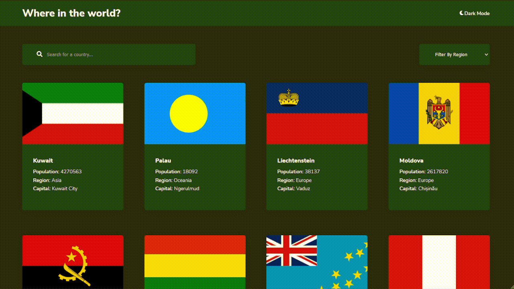
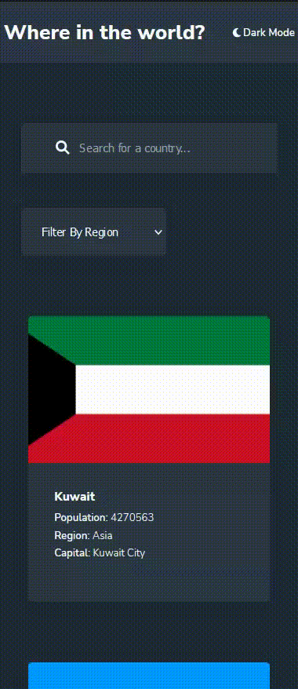

# REST Countries API with color theme switcher solution
### Features

Users should be able to:

- See all countries from the API on the homepage
- Search for a country using an `input` field
- Filter countries by region
- Click on a country to see more detailed information on a separate page
- Click through to the border countries on the detail page
- Toggle the color scheme between light and dark mode *(optional)*

### Preview
**Desktop**

**Mobile**

### Live Demo

- Link: [Click here to see it live](https://rest-countries-api-with-color-theme-switcher-master-lac.vercel.app/)

### Takeaways

**What I learned**
- React
- [Styled Components](https://styled-components.com/) - For styles

**What I learned**
I wrote it here with details : [Notion Site](https://reliable-calliandra-778.notion.site/Takeaways-from-Rest-country-project-458b2a355c434abd8e10aeacda5f42c2)

**Lets Connect and have a chat**
- Website - [Pratik Dev Das](https://www.pratikdevdas.com/)
- Twitter - [@pratikdevdas](https://twitter.com/pratikdevdas)
- LinkedIn - [@pratikdevdas](https://www.linkedin.com/in/pratikdevdas/)

**Acknowledgments**

Its a challenge from : https://www.frontendmentor.io/
 Frontend Mentor challenges help you improve your coding skills by building realistic projects. 
`